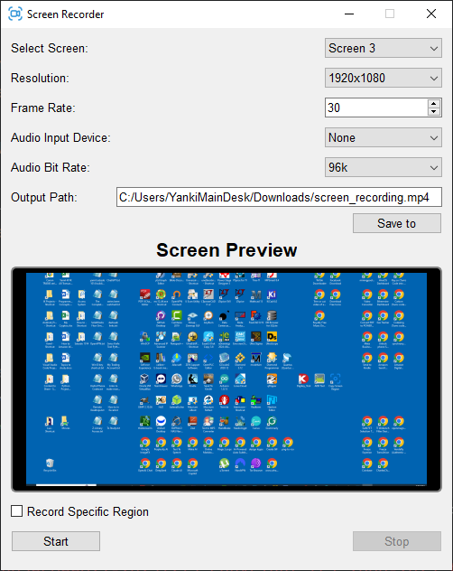

# 🎥 PyQt5 Screen Recorder with FFmpeg

A powerful, customizable screen recording application built using **PyQt5** and **FFmpeg**. This tool supports full-screen or region-based recording, audio capture from selected devices, global hotkeys, real-time visual overlay, and logs with rotation. Designed for usability, flexibility, and performance — ideal for tutorials, demos, or remote collaboration.



---

## 📚 Table of Contents

- [Features](#features)
- [Requirements](#requirements)
- [Installation](#installation)
- [Usage](#usage)
- [Basic Workflow](#basic-workflow)
- [Keyboard Shortcuts](#keyboard-shortcuts)
- [Project Structure](#project-structure)
- [Classes Overview](#classes-overview)
- [Technical Details](#technical-details)
- [Contributing](#contributing)
- [License](#license)
- [Acknowledgments](#acknowledgments)

---

## ✅ Features

- Record full screen or a selected region
- Multi-monitor support
- Audio recording from system devices (Windows)
- Configurable resolution, frame rate, and audio bit rate
- Overlay with blinking `REC` and timer during recording
- Global hotkey support (e.g., `s` to stop)
- Logging to file with rotation
- Real-time screen preview
- User-friendly GUI

---

## 🛠 Requirements

- Windows 10 or 11
- Python 3.7+
- [FFmpeg](https://ffmpeg.org/download.html) installed and added to system `PATH`
- Python packages:
  - `PyQt5`
  - `keyboard`

To install the Python packages, run:

```
pip install PyQt5 keyboard
```

---

## 💾 Installation

1. Clone this repository:

```
git clone https://github.com/your-username/pyqt5-screen-recorder.git
cd pyqt5-screen-recorder
```

2. Make sure FFmpeg is installed and added to the system `PATH`:

```
ffmpeg -version
```

3. Run the application:

```
python screen_recorder.py
```

---

## ▶️ Usage

- Select screen, resolution, frame rate, and audio input.
- Choose output path or accept the default.
- Enable "Record Specific Region" to select a custom area.
- Click **Start** to begin recording.
- Press `s` key or click **Stop** to end recording.

---

## 🔁 Basic Workflow

1. Configure screen, audio, and resolution settings.
2. (Optional) Select a region using the region selector.
3. Start recording using the GUI.
4. Minimized mode shows an overlay with blinking `REC` and a timer.
5. Stop recording using the hotkey or the stop button.
6. Output video is saved to the selected path.
7. Log events are saved in `logs/my_app.log`.

---

## ⌨️ Keyboard Shortcuts

| Key | Action         |
|-----|----------------|
| `s` | Stop recording |
| `p` | Reserved       |
| `u` | Reserved       |

These shortcuts work globally, even when the app is minimized.

---

## 🧱 Project Structure

```
.
├── screen_recorder.py         # Main GUI and logic
├── Images/
│   └── screen_recorder_icon.png
├── logs/
│   └── my_app.log             # Rotating logs (auto-generated)
└── README.md
```

---

## 🧠 Classes Overview

- **`ScreenRecorder`** – Main window, GUI layout, and signal connections.
- **`FFmpegThread`** – Launches and manages FFmpeg in a separate thread.
- **`Logger`** – Manages log files with rotation.
- **`RecordingOverlay`** – Displays a blinking REC overlay and timer.
- **`RegionSelector`** – Handles custom screen region selection.
- **`KeyListenerThread`** – Captures global keyboard shortcuts.

---

## 🔧 Technical Details

- Uses `QThread` to avoid freezing the GUI during FFmpeg execution.
- Captures screen with FFmpeg's `gdigrab` (Windows only).
- Captures audio via FFmpeg's `dshow` (Windows only).
- Ensures capture region width and height are even numbers.
- Applies custom widget styles and uses fixed window size.
- Logging implemented via `RotatingFileHandler`.

---

## 🤝 Contributing

We welcome contributions!

1. Fork the repository.
2. Create a new feature branch.
3. Commit your changes with clear messages.
4. Open a Pull Request with a detailed description.

---

## 📜 License

This project is licensed under the [MIT License](LICENSE).

---

## 🙌 Acknowledgments

- [FFmpeg](https://ffmpeg.org/)
- [PyQt5](https://riverbankcomputing.com/software/pyqt/)
- [keyboard Python library](https://pypi.org/project/keyboard/)
- And the open-source community ❤️
